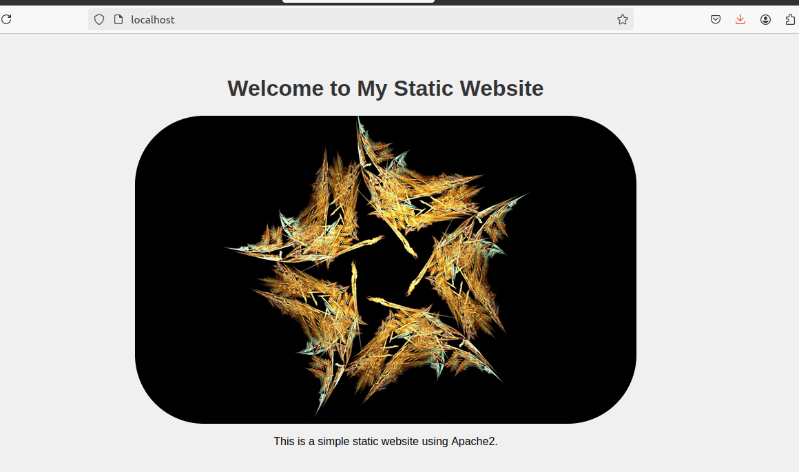

## Part 1: Creating and Editing Text Files

Create a file server_config.txt using Nano:

`nano server_config.txt`


Add the following content:
```bash
Server Name: WebServer01
IP Address: 192.168.1.100
OS: Ubuntu 20.04
```


Save and exit (Ctrl+O, Enter, Ctrl+X).

Edit the same file with Vi:

`vi server_config.txt`


Append the following text:
```bash
Installed Packages: Apache, MySQL, PHP
```


Save and exit (Esc, :wq).

Further edit the file with Vim:

`vim server_config.txt`


Add the following text:
```bash
Configuration Complete: Yes
```

Save and exit (Esc, :wq).

---
# Part 2: User & Group Management

Adding/Removing Users
Add a new user developer:

`sudo adduser developer`

Remove the user developer:

`sudo deluser developer`


Managing Groups
Create a group devteam:

`sudo groupadd devteam`

Add the user developer to the devteam group:

`sudo usermod -aG devteam developer`

Remove the user developer from the devteam group:

`sudo gpasswd -d developer devteam`


---
# Part 3: File Permissions Management

Understanding File Permissions
View permissions for server_config.txt:

`ls -l server_config.txt`

Changing Permissions and Ownership
Change permissions to read/write for the owner and read-only for others:

`chmod 644 server_config.txt`

Verify the change:

`ls -l server_config.txt`


Change the owner to developer and the group to devteam:

`sudo chown developer:devteam server_config.txt`


Verify the change:

`ls -l server_config.txt`


---
# Part 4: Controlling Services and Daemons 

Managing Services with systemctl
Start the Apache service:

`sudo systemctl start apache2`


Stop the Apache service:

`sudo systemctl stop apache2`


Enable the Apache service to start on boot:

`sudo systemctl enable apache2`


Disable the Apache service:

`sudo systemctl disable apache2`


Check the status of the Apache service:

`sudo systemctl status apache2`


---
# Part 5: Process Handling 
Scenario: Monitor and manage processes to ensure the server is performing optimally.
Viewing Processes
List all running processes:

`ps aux`


Use top to view processes in real-time:

`top`


Managing Processes
Identify a process to kill using ps or top, then kill it:

`kill <PID>`


Change the priority of a process (e.g., running sleep with a lower priority):

`nice -n 10 sleep 100 &`


Change the priority of the process using renice:

`renice +10 <PID>`


---
# Creating and Deploying a Static Website with Apache

---
# Part 1: Installing Apache2
Update Package Lists

`sudo apt update`

Install Apache2 by running:

`sudo apt install apache2`

Start the Apache2 service:

`sudo systemctl start apache2`


Enable Apache2 to start on boot:

`sudo systemctl enable apache2`


Verify Installation
Open a web browser and navigate to http://your_server_ip. You should see the Apache2 default page.

---
# Part 2: Creating the Website 
Navigate to the Web Directory

`cd /var/www/html`

Create a New Directory for the Website
Create a directory named mystaticwebsite:

`sudo mkdir mystaticwebsite`


Change ownership of the directory:

`sudo chown -R $USER:$USER /var/www/html/mystaticwebsite`


Create and edit the index.html file:

`nano /var/www/html/mystaticwebsite/index.html`


Add the following content:
```bash
<!DOCTYPE html>
<html>
<head>
  <title>My Static Website</title>
  <link rel="stylesheet" type="text/css" href="styles.css">
</head>
<body>
  <h1>Welcome to My Static Website</h1>
  <p>This is a simple static website using Apache2.</p>
  <script src="script.js"></script>
</body>
</html>
```


Save and exit (Ctrl+O, Enter, Ctrl+X).
Create CSS File
Create and edit the styles.css file:

`nano /var/www/html/mystaticwebsite/styles.css`


Add the following content:
```bash
body {
  font-family: Arial, sans-serif;
  background-color: #f0f0f0;
  text-align: center;
  margin: 0;
  padding: 20px;
}

h1 {
  color: #333;
}
```

Save and exit (Ctrl+O, Enter, Ctrl+X).
Create JavaScript File
Create and edit the script.js file:

`nano /var/www/html/mystaticwebsite/script.js`


Add the following content:
```bash
document.addEventListener('DOMContentLoaded', function() {
  console.log('Hello, World!');
});
```

Save and exit (Ctrl+O, Enter, Ctrl+X).
Add an Image
Download or copy an image file (e.g., logo.png) to the website directory:

`cp /path/to/your/logo.png /var/www/html/mystaticwebsite/logo.png`


Update index.html to include the image:
```bash
<body>
  <h1>Welcome to My Static Website</h1>
  
  <p>This is a simple static website using Apache2.</p>
  <script src="script.js"></script>
</body>
```
---
# Part 3: Configuring Apache2 to Serve the Website

Create and edit the virtual host configuration file:

`sudo nano /etc/apache2/sites-available/mystaticwebsite.conf`


Add the following content:

```bash
<VirtualHost *:80>
  ServerAdmin webmaster@localhost
  DocumentRoot /var/www/html/mystaticwebsite
  ErrorLog ${APACHE_LOG_DIR}/error.log
  CustomLog ${APACHE_LOG_DIR}/access.log combined
</VirtualHost>
```

Save and exit (Ctrl+O, Enter, Ctrl+X).

Enable the virtual host configuration:

`sudo a2ensite mystaticwebsite.conf`

Disable the default site configuration:

`sudo a2dissite 000-default.conf`


Reload the Apache2 service to apply the changes:

`sudo systemctl reload apache2`


Test the Configuration
Open a web browser and navigate to http://your_server_ip. You should see the static website with the HTML, CSS, JS, and image.





