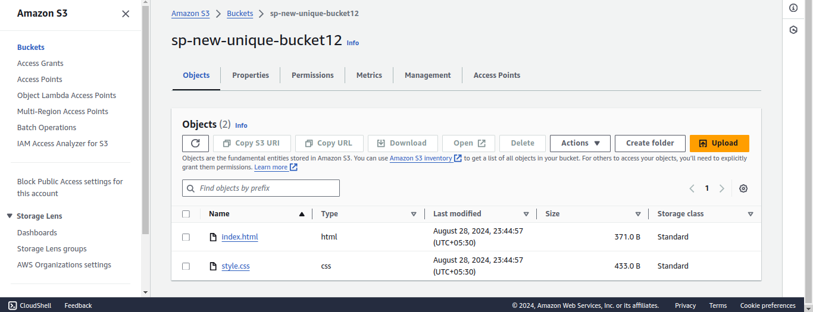
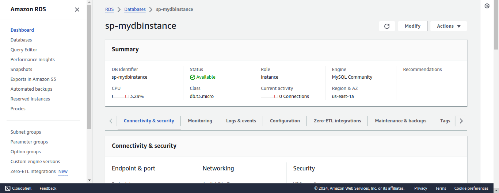

# Multi-Tier Application Deployment with Helm, S3, and RDS

## 1. Create an S3 Bucket

### 1.1 Create an S3 Bucket

Create an S3 bucket to store static files for the frontend service:

```bash
aws s3api create-bucket --bucket sp-new-unique-bucket12 --region us-east-1
```


### 1.2 Upload Static Files

Upload your static files to the S3 bucket:

```bash
aws s3 cp /home/einfochips/Desktop/SP/Training/Day33/index.html/ s3://sp-new-unique-bucket12/ --recursive
```


## 2. Set Up an RDS MySQL Instance

### 2.1 Create an RDS MySQL Instance

Create an RDS MySQL instance using AWS CLI:

```bash
aws rds create-db-instance \
    --db-instance-identifier sp-mydbinstance \
    --allocated-storage 20 \
    --db-instance-class db.t3.micro \
    --engine mysql \
    --master-username admin \
    --master-user-password password123 \
    --backup-retention-period 7 \
    --availability-zone us-east-1a \
    --no-multi-az \
    --engine-version 8.0 \
    --auto-minor-version-upgrade \
    --publicly-accessible \
    --storage-type gp2 \
    --db-name mydatabase \
    --region us-east-1
```


## 3. Create Helm Charts
start Minikube  and check status
```bash
minikube start

minikube status
```


### 3.1 Create the Frontend Helm Chart


```bash
helm create frontend
```


Modify the Helm chart as follows:

#### `frontend/values.yaml`

```yaml
replicaCount: 1

image:
  repository: nginx
  tag: stable
  pullPolicy: IfNotPresent

service:
  type: ClusterIP
  port: 80

ingress:
  enabled: false

resources: {}

nodeSelector: {}

tolerations: []

affinity: []

files:
  staticUrl: "http://your-bucket-name.s3.amazonaws.com/"
```

#### `frontend/templates/deployment.yaml`

Modify the NGINX configuration to pull static files from the S3 bucket:

```yaml
apiVersion: apps/v1
kind: Deployment
metadata:
  name: {{ include "frontend.fullname" . }}
  labels:
    {{- include "frontend.labels" . | nindent 4 }}
spec:
  replicas: {{ .Values.replicaCount }}
  selector:
    matchLabels:
      {{- include "frontend.selectorLabels" . | nindent 6 }}
  template:
    metadata:
      labels:
        {{- include "frontend.selectorLabels" . | nindent 8 }}
    spec:
      containers:
        - name: nginx
          image: "{{ .Values.image.repository }}:{{ .Values.image.tag }}"
          imagePullPolicy: {{ .Values.image.pullPolicy }}
          ports:
            - name: http
              containerPort: 80
```

### 3.2 Create the Backend Helm Chart


```bash
helm create backend
```


Modify the Helm chart as follows:

#### `backend/values.yaml`

```yaml
replicaCount: 1

image:
  repository: your-backend-image
  tag: latest
  pullPolicy: IfNotPresent

service:
  type: ClusterIP
  port: 5000

ingress:
  enabled: false

resources: {}

nodeSelector: {}

tolerations: []

affinity: []

database:
  host: "your-rds-endpoint"
  name: "mydatabase"
  user: "admin"
  password: "password123"
  port: 3306
```

#### `backend/templates/deployment.yaml`

Modify the deployment to connect to the RDS MySQL instance:

```yaml
apiVersion: apps/v1
kind: Deployment
metadata:
  name: {{ include "backend.fullname" . }}
  labels:
    {{- include "backend.labels" . | nindent 4 }}
spec:
  replicas: {{ .Values.replicaCount }}
  selector:
    matchLabels:
      {{- include "backend.selectorLabels" . | nindent 6 }}
  template:
    metadata:
      labels:
        {{- include "backend.selectorLabels" . | nindent 8 }}
    spec:
      containers:
        - name: backend
          image: "{{ .Values.image.repository }}:{{ .Values.image.tag }}"
          imagePullPolicy: {{ .Values.image.pullPolicy }}
          ports:
            - name: http
              containerPort: 3000
          env:
            - name: DB_HOST
              valueFrom:
                secretKeyRef:
                  name: backend-secrets
                  key: db_host
            - name: DB_PORT
              value: {{ .Values.mysql.port | quote }}
            - name: DB_USER
              valueFrom:
                secretKeyRef:
                  name: backend-secrets
                  key: db_user
            - name: DB_PASSWORD
              valueFrom:
                secretKeyRef:
                  name: backend-secrets
                  key: db_password
          resources:
            {{- toYaml .Values.resources | nindent 12 }}
```

## 4. Package Helm Charts

Navigate to each chart directory and package them:

```bash
cd frontend
helm package .
mv frontend-0.1.0.tgz ../

cd ../backend
helm package .
mv backend-0.1.0.tgz ../
```


## 5. Deploy Multi-Tier Application Using Helm

### 5.1 Deploy the Backend Chart

```bash
helm install backend ./backend-0.1.0.tgz
```


### 5.2 Deploy the Frontend Chart

```bash
helm install frontend ./frontend-0.1.0.tgz
```


## 6. Manage Helm Secrets

Use Helm secrets to manage sensitive data. Install the `helm-secrets` plugin if not already installed:

```bash
helm secrets enc secrets.yaml
```

Store sensitive information in `secrets.yaml`:

```yaml
database:
  password: "password123"
aws:
  access_key: "your-access-key"
  secret_key: "your-secret-key"
```

## 7. Implement RBAC

Create a Role and RoleBinding for Helm in your Kubernetes cluster:

### `rbac.yaml`

```yaml
kind: Role
apiVersion: rbac.authorization.k8s.io/v1
metadata:
  namespace: default
  name: helm-role
rules:
- apiGroups: ["", "apps", "extensions"]
  resources: ["pods", "deployments", "services", "secrets", "configmaps"]
  verbs: ["get", "list", "watch", "create", "delete", "patch", "update"]
---
kind: RoleBinding
apiVersion: rbac.authorization.k8s.io/v1
metadata:
  name: helm-rolebinding
  namespace: default
subjects:
- kind: User
  name: helm-user
  apiGroup: rbac.authorization.k8s.io
roleRef:
  kind: Role
  name: helm-role
  apiGroup: rbac.authorization.k8s.io
```

Apply the RBAC configuration:

```bash
kubectl apply -f rbac.yaml
```


## 8. Validate Deployment

Check the status of Helm releases:

```bash
helm list
```


## 9. Cleanup

To clean up the resources created by this guide:

```bash
helm uninstall frontend
helm uninstall backend
```
images/Screenshot from 2024-08-29 01-25-09.png

```bash
aws s3 rm s3://your-bucket-name/ --recursive
```

```bash
aws rds delete-db-instance --db-instance-identifier mydbinstance --skip-final-snapshot
```

```bash
minikube stop
minikube delete
```

