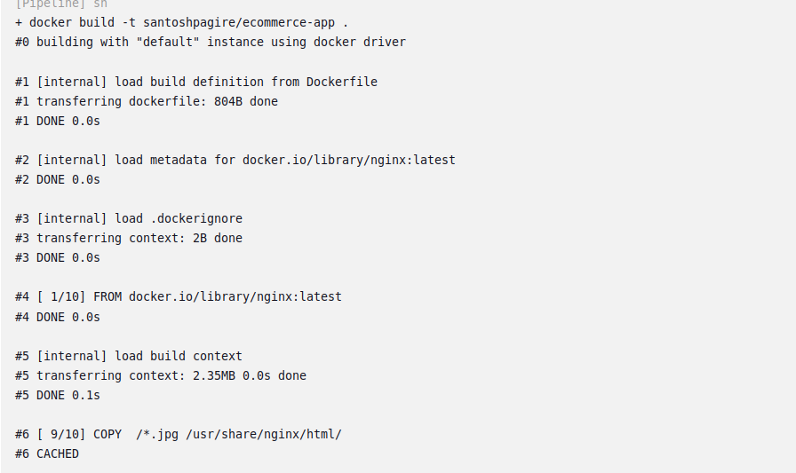
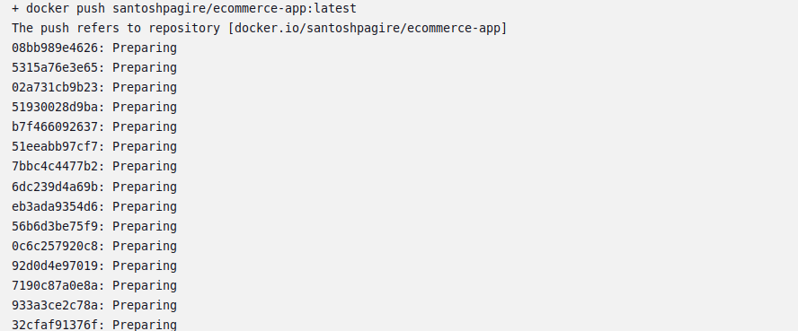

# Modular E-Commerce Application Deployment with S3 Integration

## Project Objectives

1. **Modular Infrastructure:** Use Terraform to create and manage modular infrastructure components.
2. **Static Asset Storage:** Store and fetch static assets from an S3 bucket.
3. **Containerization:** Package the application using Docker.
4. **Orchestration:** Deploy the application on Kubernetes.
5. **CI/CD Pipeline:** Automate the build and deployment process using Jenkins.
6. **Configuration Management:** Use Ansible for configuration management.
7. **Deployment:** Deploy the application using Helm charts.
8. **AWS Resources:** Utilize AWS EC2 free tier instances for deployment.

## Project Tasks and Timeline

### 1. Set Up AWS EC2 Instances 
- Launch three EC2 instances of type `t2.micro` (1 master node, 2 worker nodes) within the free tier.


- Configure security groups to allow necessary ports (e.g., 22 for SSH, 80 for HTTP, 443 for HTTPS).


- SSH into the instances and prepare for Kubernetes installation.


### 2. Create and Configure S3 Bucket 
- Create an S3 bucket to store static assets (e.g., product images, stylesheets).


- Upload sample static files to the S3 bucket.


### 3. Set Up Kubernetes Cluster 
- **On Master Node:**
  - Install Kubeadm, Kubelet, and Kubectl.
  - Initialize the Kubernetes cluster using Kubeadm.
  - Set up a network plugin (e.g., Calico, Flannel).

- **On Worker Nodes:**
  - Join worker nodes to the master node.


### 4. Modularize Infrastructure with Terraform 
- **Create Terraform Modules:**
  - **Network Module:** Define VPC, subnets, and security groups.
  - **Compute Module:** Define EC2 instances for Kubernetes nodes.
  - **Storage Module:** Define S3 bucket for static assets.
- **Main Configuration:**
  - Create a `main.tf` file to utilize the modules and provision the entire infrastructure.
- **Initialize and Apply:**
  - Run `terraform init`, `terraform plan`, and `terraform apply` to provision the infrastructure.


### 5. Containerize the Application with Docker 
- **Dockerfile:** Write Dockerfile for the e-commerce application.

[Dockerfile](frontend/Dockerfile)
```yml
# Use the official Nginx image from Docker Hub
FROM nginx:latest

# Copy custom Nginx configuration file into the container
# If you have custom configurations, you can include them
COPY nginx.conf /etc/nginx/nginx.conf

# Copy your web content into the container
# This example assumes you have a directory named `public-html` with your web content
COPY /css /usr/share/nginx/html/css
COPY /img /usr/share/nginx/html/img
COPY /js /usr/share/nginx/html/js
COPY /lib /usr/share/nginx/html/lib
COPY /scss /usr/share/nginx/html/scss
COPY  /*.html /usr/share/nginx/html/
COPY  /*.jpg /usr/share/nginx/html/
COPY  /*.txt /usr/share/nginx/html/
# Expose port 80 to the outside world
EXPOSE 80
```
- **Build Docker Image:** Build Docker images using the Dockerfile.

- **Push to Registry:** Push Docker images to a Docker registry (e.g., Docker Hub, Amazon ECR).



### 6. Configure Ansible for Application Deployment 
- **Ansible Playbooks:** Write playbooks to configure Kubernetes nodes and deploy the application.
- **Test Playbooks:** Run Ansible playbooks to ensure correct configuration.


### 7. Set Up Jenkins for CI/CD 

- **Configure Jenkins Pipeline:**
  - Create a Groovy pipeline script in Jenkins for CI/CD.
  
  [Jenkinsfile](Jenkinsfile)
  
  - The pipeline should include stages for:
    - **Source Code Checkout:** Pull code from the Git repository.
    - **Build Docker Image:** Build Docker images from the Dockerfile.
    - **Push Docker Image:** Push Docker image to Docker registry.
    
    
    

### 8. Deploy the Application with Helm 
- **Create Helm Charts:** Define Helm charts for the e-commerce application deployment.

- **Install Helm Charts:** Deploy the application to Kubernetes using Helm charts.


- **Verify Deployment**

- Check on which dataplane application is deployed


- **Check Output:**

### 9. Clean Up Resources 
- **Terminate Resources:** Use Terraform to destroy all provisioned infrastructure by running `terraform destroy`.


